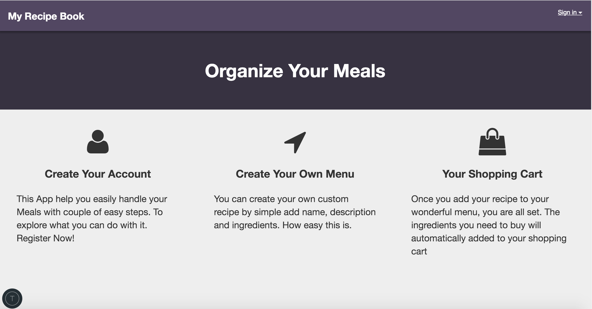
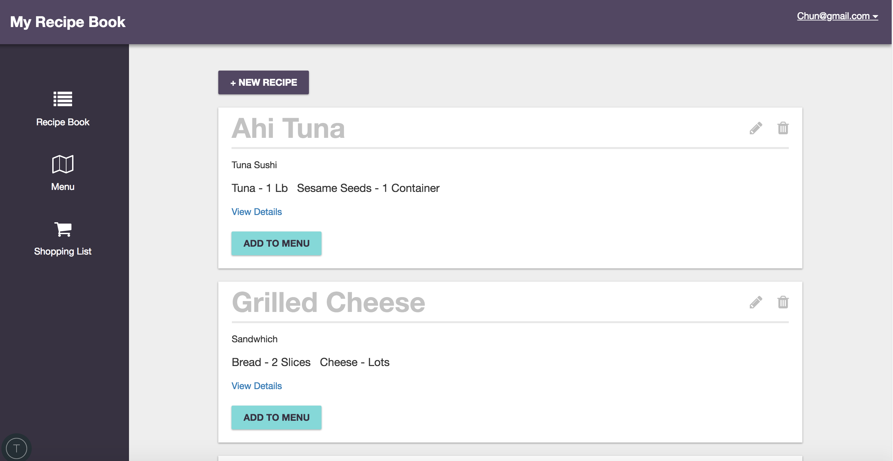
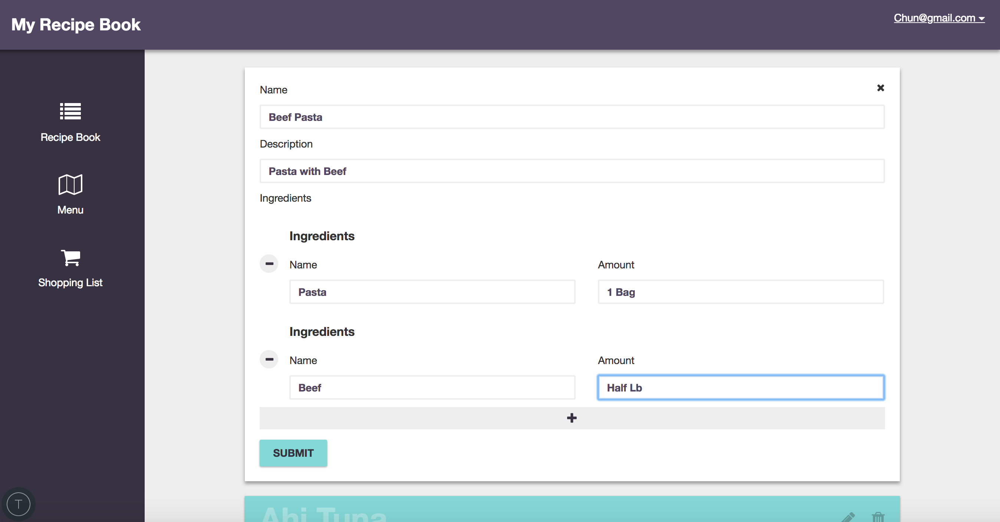
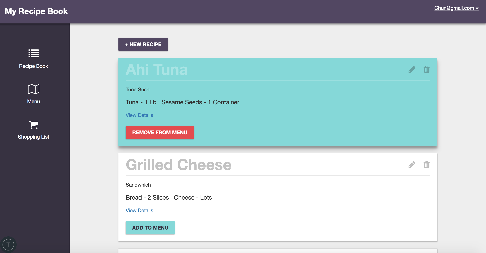
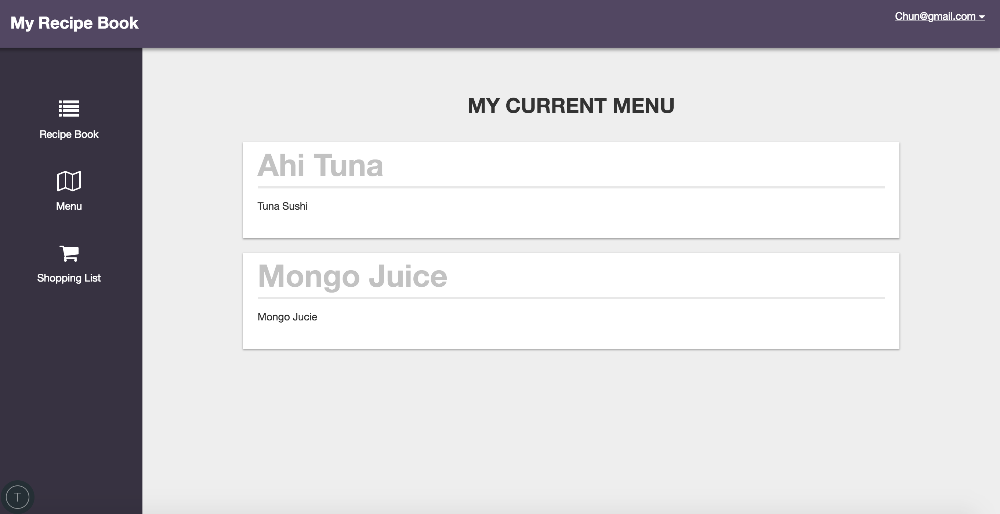
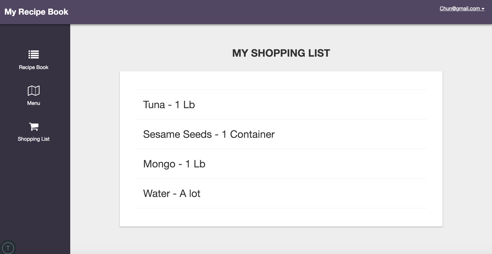

# My Recipe Book

## Set up
1. Install meteor and npm
  * Make sure you have npm installed.
  * If you are using OSX or LINUX put "curl https://install.meteor.com/ | sh" in your terminal.
  * If you are using Windows, first install Chocolatey, then run this command using an Administrator command prompt: choco install meteor.
2. Install Depedencies:
  * Run "meteor npm install" to install all the depedencies in the project.
3. Install MongoDB
  * Meteor use MongoDB, if you do not have MongoDB, then download it.
4. Go to the root directory of the project in terminal then run "meteor" to start the project.     

## Project Intro

This project is created with Meteor framework which use the JavaScript, MongoDB. I get to know this framework through a tech coding interview and I found this framework pretty handy.

After you register your account, you will automatically redirect to recipe-book page.

As you can see, you can created your own recipe by adding name, description and ingredients details. Once you created the recipe, you can add it to your menu.

Once you created your recipe, you can add it to your menu.

Your shopping list will show everything you added to your menu.

## Possible Improvement

There are still many stuffs I can add to this project

* Stripe: Handle payment for membership
* Shopping Information: Show the discount information from main grocery stores related to user's shopping list items
